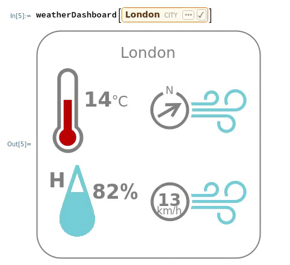

## Weather data dashboard

In this project, you will use the Wolfram Language to create a weather dashboard, which will show the temperature, humidity, wind speed, and wind direction for a specific city.

### What you will make

--- collapse ---
---
title: What you will need
---
### Hardware

+ A computer: desktop, laptop, or a Raspberry Pi

### Software

+ Wolfram Language, available for free on the Raspberry Pi as part of the official operating system, Raspbian

--- /collapse ---

--- collapse ---
---
title: What you will learn
---

+ How to manipulate weather data in the Wolfram Language
+ How to use Freefrom Lingustic Input in the Wolfram Language
+ How to create functions in the Wolfram Language

--- /collapse ---

--- collapse ---
---
title: Additional information for educators
---

If you need to print this project, please use the [printer-friendly version](https://projects.raspberrypi.org/en/projects/c3-wolfram-weather-dashboard/print){:target="_blank"}.

--- /collapse ---
