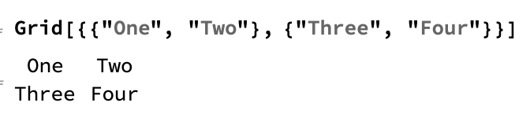
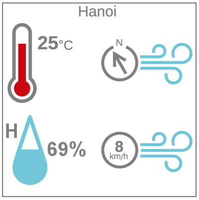
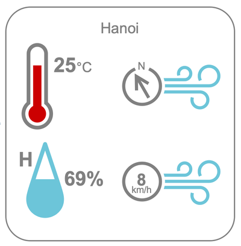

## Create a weather dashboard

You have all the information you need to build a dashboard. Now, you need to design a simple layout.

You can use the `Grid` function to customise the layout of the dashboard. With `Grid`, you can put items into evenly spaced rows and columns.



The four measurements need to be shown in a grid with the temperature and humidity on the left, and the wind speed and wind direction on the right.

That means that they need to be in the order `{Temperature, WindDirection"},{Humidity, WindSpeed}`.

---task---

Build a grid using your `IconData` and `WeatherData` code.

```
Grid[{
  {IconData["AirTemperature", WeatherData["Hanoi", "Temperature"]],
  IconData["WindDirection", WeatherData["Hanoi", "WindDirection"]]},
  {IconData["RelativeHumidity", WeatherData["Hanoi", "Humidity"]],
  IconData["WindSpeed", WeatherData["Hanoi", "WindSpeed"]]}
  }]
  ```

---/task---

Next, you will use `Show` to make all the icons larger. With `Show`, you can use `ImageSize` to put in the size of the image.

To make your output (dashboard) look more balanced, you might want to make the `WindSpeed` and `WindDirection` icons a bit bigger. 

--- task ---

Set the `ImageSize` to 150 for the icons for `AirTemperature` and `RelativeHumidity`, and to 170 for `WindSpeed` and `WindDirection`, as in the example below.

```
Grid[{
  {Show[IconData["AirTemperature", WeatherData["Hanoi", "Temperature"]], ImageSize -> 150], 
  Show[IconData["WindDirection", WeatherData["Hanoi", "WindDirection"]], ImageSize -> 170]}, 
  {Show[IconData["RelativeHumidity", WeatherData["Hanoi", "Humidity"]], ImageSize -> 150],
  Show[IconData["WindSpeed", WeatherData["Hanoi", "WindSpeed"]], ImageSize -> 170]}
  }]
```

--- /task ---

--- task ---
Add a title to your output by adding another row to the `Grid`. Use `Text` to show the title in text format, and use `Style` to choose the size and colour of the text.
To put the title in the centre of the `Grid`, use `SpanFromLeft` to make the text row run across both columns.

```
Grid[{
  {Text[Style["Hanoi", Large, Gray]], SpanFromLeft},
  {Show[IconData["AirTemperature", WeatherData["Hanoi", "Temperature"]], ImageSize -> 150],
  Show[IconData["WindDirection", WeatherData["Hanoi", "WindDirection"]], ImageSize -> 170]},
  {Show[IconData["RelativeHumidity", WeatherData["Hanoi", "Humidity"]], ImageSize -> 150],
  Show[IconData["WindSpeed", WeatherData["Hanoi", "WindSpeed"]], ImageSize -> 170]}
  }]
```
--- /task ---

Next, put a frame around the icons, so that the dashboard looks more connected. To do this, you can put a `Framed` function around the code you have for the `Grid`.



If you like, you can try different features for the frame. You can use `RoundingRadius` to make the corners rounder, you can use `FrameMargins` to put a bigger white space between the icons and the frame, and you can use `FrameStyle` to change the colour and thickness of the frame.

--- task ---

Add options to `Framed` to make a nice output.

```
Framed[
 Grid[{
  {Text[Style["Hanoi", Large, Gray]], SpanFromLeft},
  {Show[IconData["AirTemperature", WeatherData["Hanoi", "Temperature"]], ImageSize -> 150],
  Show[IconData["WindDirection", WeatherData["Hanoi", "WindDirection"]], ImageSize -> 170]},
  {Show[IconData["RelativeHumidity", WeatherData["Hanoi", "Humidity"]], ImageSize -> 150],
  Show[IconData["WindSpeed", WeatherData["Hanoi", "WindSpeed"]], ImageSize -> 170]}
  }],
  RoundingRadius -> 40, FrameMargins -> 20, FrameStyle -> {Thick, Gray}]
 ```



--- /task ---
