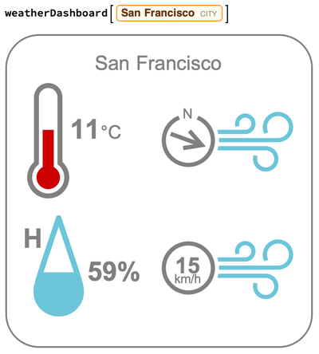

## Creating a Function

Now that we have a user friendly dashboard, we can build a more general function, so that we can use any city as a location without having to change it in multiple places.

In Wolfram, we can define a function using `:=`. A function allows us to build code using `location` as a placeholder for the city we want to create a weather dashboard for. Then we run the weather dashboard function using actual city, for example: `weatherDashboard["London"]`, and every place in the code where we use the parameter `location`, it's replaced with "London".

--- task ---
Make a function called `weatherDashboard`, which has a parameter `location`.

Use `CommonName[location]` to extract the name of your city for the title.

```
weatherDashboard[location_] :=
 Framed[
  Grid[{
  {Text[Style[CommonName[location], Large, Gray]], SpanFromLeft},
  {Show[IconData["AirTemperature", WeatherData[location, "Temperature"]], ImageSize -> 150],
  Show[IconData["WindDirection", WeatherData[location, "WindDirection"]], ImageSize -> 170]},
  {Show[IconData["RelativeHumidity", WeatherData[location, "Humidity"]], ImageSize -> 150],
  Show[IconData["WindSpeed", WeatherData[location, "WindSpeed"]], ImageSize -> 170]}
  }],
  RoundingRadius -> 40, FrameMargins -> 20, FrameStyle -> {Thick, Gray}]
  ```

--- /task ---
  
Now we can run weatherDashboard with any city simply by evaluating both the function above, and then calling the function with a specific location. You will need to use the Freeform Entry box as described in the "Exploring Weather Data" step.


  
--- task ---
Call the weatherDashboard function with a few different cities.

Use `$GeoLocationCity` to use the location of your own computer as the city.
  
```
weatherDashboard[$GeoLocationCity]
```
--- /task ---

Congratualations, you have created a functioning weather dashboard. You can run it for any city you choose, or for your geolocation.
